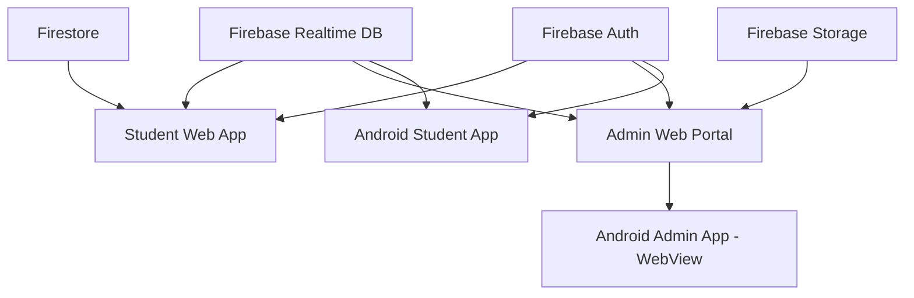
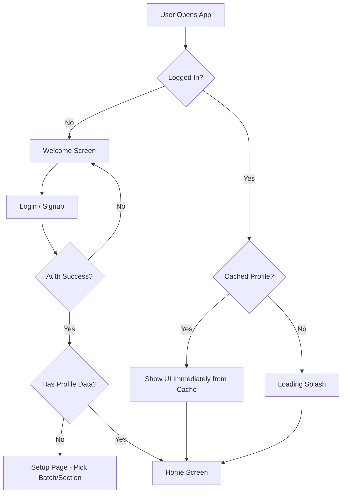

# Neram — Developer Guide

> **Neram** is a college academic management platform for RMK Group of Institutions. It helps students view their schedules, calendar events, exam timetables, and notes — while admins manage all academic data through a separate admin portal.

---

## 1. Project Overview

Neram has **3 platforms**, all in one monorepo:

| Platform | Tech Stack | Entry Point | Deployed At |
|---|---|---|---|
| **Student Web App** | React + Vite | `web/index.html` → `App.jsx` | Vercel (auto-deploy) |
| **Admin Web Portal** | React + Vite | `web/admin.html` → `AdminApp.jsx` | Vercel (same domain, `/admin.html`) |
| **Android Student App** | Kotlin + Jetpack Compose | `mobile/app/` → `MainActivity.kt` | Play Store / APK |
| **Android Admin App** | Kotlin + WebView | `mobile/admin/` → `AdminMainActivity.kt` | Play Store / APK |

### How They Connect



All 3 platforms read/write to the **same Firebase Realtime Database**. Changes made in the Admin Portal are instantly visible to students on both web and mobile.

---

## 2. Folder Structure

```
Neram/
├── web/                          ← React Web App (Vite)
│   ├── index.html                ← Student app entry (BrowserRouter)
│   ├── admin.html                ← Admin portal entry (HashRouter)
│   ├── public/
│   │   ├── icons/                ← Favicons for both apps
│   │   ├── manifests/            ← PWA manifests (light + dark variants)
│   │   ├── pdfs/                 ← Academic calendar PDF
│   │   └── sw.js                 ← Service worker
│   └── src/
│       ├── App.jsx               ← Student app root (auth, routing, data sync)
│       ├── AdminApp.jsx          ← Admin portal root (auth, routing)
│       ├── firebase.js           ← Firebase config (uses env variables)
│       ├── pages/
│       │   ├── admin/            ← Admin screens
│       │   ├── student/          ← Student screens
│       │   └── auth/             ← Login, Signup, Setup
│       ├── components/
│       │   ├── navigation/       ← Navbars, Sidebars
│       │   ├── ui/               ← Shared widgets (Splash, ThemeToggle)
│       │   └── features/         ← Calendar builder, Live embed
│       ├── styles/               ← CSS organized by domain
│       ├── data/                 ← Static data files
│       ├── hooks/                ← Custom React hooks
│       └── utils/                ← Helper functions
│
├── mobile/                       ← Android Native (Kotlin)
│   ├── app/src/main/java/.../    ← Student app (Jetpack Compose)
│   │   ├── ui/
│   │   │   ├── home/             ← Home screen + components
│   │   │   ├── schedule/         ← Timetable viewer
│   │   │   ├── calendar/         ← Academic calendar
│   │   │   ├── notes/            ← Notes/documents viewer
│   │   │   ├── settings/         ← 9 settings screens
│   │   │   ├── about/            ← About, Contact, Feedback
│   │   │   ├── auth/             ← Login, Signup, Welcome
│   │   │   ├── profile/          ← Edit profile
│   │   │   ├── directory/        ← User directory browser
│   │   │   ├── navigation/       ← Bottom nav, Top bar, Menu
│   │   │   ├── components/       ← Shared Compose widgets
│   │   │   ├── common/           ← PDF viewer, shared logic
│   │   │   └── theme/            ← Colors, Fonts, Transitions
│   │   ├── data/
│   │   │   ├── local/            ← Room DB (DAOs, Entities)
│   │   │   ├── model/            ← Data classes
│   │   │   ├── preferences/      ← Theme/Language managers
│   │   │   └── repository/       ← Firebase data access
│   │   ├── utils/                ← Alarms, Email, Date helpers
│   │   ├── receivers/            ← Boot + Daily alarm receivers
│   │   └── workers/              ← Background sync worker
│   └── admin/src/main/           ← Admin WebView wrapper (1 Activity)
│
├── database.rules.json           ← Firebase Security Rules
├── cors.json                     ← Firebase Storage CORS config
├── google-services.json          ← Firebase Android config
└── .gitignore
```

---

## 3. Student Web App — All Pages

Entry: `web/src/App.jsx` → Uses **BrowserRouter**

| Route | Component | What It Does |
|---|---|---|
| `/` | `Home.jsx` | Dashboard: today's schedule, daily updates, upcoming events |
| `/schedule` | `Schedule.jsx` | Full weekly timetable view (desktop + mobile layouts) |
| `/calendar` | `Calendar.jsx` | Academic calendar with month/list views |
| `/notes` | `Notes.jsx` | Browse and view study materials (PDF/documents) |
| `/college-sites` | `CollegeSites.jsx` | Quick links to important college websites |
| `/settings` | `Settings.jsx` | User preferences hub → sub-pages below |
| `/login` | `LoginPage.jsx` | Email/Google sign-in for students |
| `/signup` | `SignupPage.jsx` | New student registration |

### Settings Sub-Pages (inside `pages/student/settings/`)

| File | What It Does |
|---|---|
| `SettingsHub.jsx` | Main settings menu (links to all settings sub-pages) |
| `ProfileView.jsx` | View/edit user profile (name, batch, section) |
| `DisplaySettings.jsx` | Theme mode (light/dark/auto) |
| `SecuritySettings.jsx` | Password change, linked accounts |
| `StorageSettings.jsx` | Clear cached data, manage storage |
| `AboutPage.jsx` | About the app, version info |
| `AboutRMKPage.jsx` | About RMK Group of Institutions |
| `DeveloperPage.jsx` | Developer info and credits |
| `FoundersPage.jsx` | Management team information |
| `FeedbackView.jsx` | Submit complaints/feedback |
| `UserDirectoryView.jsx` | Browse all registered users by batch/section |

---

## 4. Admin Web Portal — All Modules

Entry: `web/src/AdminApp.jsx` → Uses **HashRouter** (because it runs inside a WebView on Android)

The Admin Portal uses a **single-page module switcher** — `AdminPanel.jsx` loads modules via `?mod=` URL parameter.

| Module (`?mod=`) | Component | What It Does |
|---|---|---|
| `home` | `AdminDashboard.jsx` | Overview: total students, recent activity, quick actions |
| `users` | `UserManagement.jsx` | View/search/edit all registered student accounts |
| `roles` | `AdminRoleManager.jsx` | Assign admin/faculty/rep roles to users |
| `faculty` | `FacultyDirectory.jsx` | Manage faculty member directory |
| `schedules` | `ScheduleManager.jsx` | Create/edit weekly timetable for any batch/section |
| `exams` | `ExamManager.jsx` | Manage exam schedules and timetables |
| `events` | `EventManager.jsx` | Create section-specific daily updates and announcements |
| `calendar` | `CalendarManager.jsx` | Import and manage academic calendar events |
| `resources` | `ResourceManager.jsx` | Upload PDF resources to Firebase Storage |
| `notes` | `NotesManager.jsx` | Manage study materials and documents |
| `structure` | `StructureManager.jsx` | Configure academic hierarchy (batches, departments, sections) |
| `pending` | `PendingRequests.jsx` | Approve/reject new admin signup requests |
| `archives` | `SemesterTransitionManager.jsx` | Archive old semester data for fresh start |
| `special_classes` | `SpecialClassManager.jsx` | Manage one-off special class schedules |

### Role-Based Access Control

| Role | Can Access | Blocked From |
|---|---|---|
| **Super Admin** | Everything | Nothing |
| **Faculty** | Users, Roles, Schedules, Exams, Events, Calendar, Notes | Structure, Archives, Faculty Directory, Pending |
| **Rep** (Class Rep) | Roles, Schedules, Exams, Events, Notes, Special Classes | Users, Structure, Calendar, Resources, Faculty, Archives, Pending |

Roles are defined in `web/src/data/admins.js`. Hardcoded emails get instant access; others need DB-level role assignment.

---

## 5. Android Student App — All Screens

Entry: `mobile/app/.../MainActivity.kt` → `MainScreen.kt` (Jetpack Compose)

### Tab Screens (Bottom Navigation)

| Tab | Kotlin File | What It Does |
|---|---|---|
| 🏠 Home | `ui/home/HomeScreen.kt` | Today's schedule, updates, upcoming events |
| 📅 Schedule | `ui/schedule/ScheduleScreen.kt` | Weekly timetable |
| 📆 Calendar | `ui/calendar/CalendarScreen.kt` | Academic calendar (month + schedule views) |
| 📝 Notes | `ui/notes/NotesScreen.kt` | Browse study materials |

### Settings Screens (`ui/settings/`)

| Kotlin File | What It Does |
|---|---|
| `SettingsScreen.kt` | Main settings menu |
| `DisplaySettingsScreen.kt` | Theme (light/dark/auto) |
| `SecuritySettingsScreen.kt` | Password, account security |
| `LinkedAccountsScreen.kt` | Link/unlink Google account |
| `LanguageSettingsScreen.kt` | App language (English/Tamil/Japanese) |
| `NotificationSettingsScreen.kt` | Push notification preferences |
| `StorageSettingsScreen.kt` | Clear cached data |
| `CalendarSettingsScreen.kt` | Calendar display preferences |

### About & Info Screens (`ui/about/`)

| Kotlin File | What It Does |
|---|---|
| `AboutAppScreen.kt` | App version, credits |
| `AboutRMKScreen.kt` | About RMK Group |
| `ManagementTeamScreen.kt` | College management info |
| `DeveloperInfoScreen.kt` | Developer credits |
| `ContactScreen.kt` | Contact form |
| `CollegeSitesScreen.kt` | College website links |
| `ComplaintScreen.kt` | Feedback/complaint form |

### Other Screens

| Kotlin File | What It Does |
|---|---|
| `ui/profile/ProfileScreen.kt` | Edit user profile |
| `ui/directory/UserDirectoryScreen.kt` | Browse users by batch/section |
| `ui/auth/LoginScreen.kt` | Email + Google sign-in |
| `ui/auth/SignupScreen.kt` | New user registration |
| `ui/auth/WelcomeScreen.kt` | First-time welcome/landing |
| `ui/onboarding/OnboardingScreen.kt` | App introduction slides |
| `ui/notifications/NotificationScreen.kt` | View notifications |
| `ui/common/PdfViewerScreen.kt` | In-app PDF viewer |
| `ui/alerts/FullScreenAlertActivity.kt` | System alert overlay |

---

## 6. Android Admin App

Entry: `mobile/admin/.../AdminMainActivity.kt`

This is a **simple WebView wrapper** — it loads the Admin Web Portal (`adminneram.vercel.app/admin`) inside a fullscreen WebView. It provides:

- **Native Google Sign-In** via `NativeBridge.loginWithGoogle()` JS interface
- **Theme sync** — web app calls `NativeBridge.setTheme(isDark)` to update Android status bar colors
- **Back button handling** — delegates to web app's `window.handleNativeBack()` JS function
- **Offline screen** with retry button

---

## 7. Data Layer & Firebase Structure

### Firebase Services Used

| Service | What For | Config |
|---|---|---|
| **Realtime Database** | All app data (schedules, calendar, users, updates) | `firebase.js` → `getDatabase()` |
| **Authentication** | Google Sign-In, Email/Password, Anonymous | `firebase.js` → `getAuth()` |
| **Firestore** | Contact form submissions | `firebase.js` → `getFirestore()` |
| **Storage** | PDF resource uploads | `firebase.js` → `getStorage()` |

### Realtime Database Structure

```
root/
├── users/{uid}/              ← User profiles (name, batch, department, section, role)
├── schedules/{batch}/{dept}/{section}/
│   ├── courses[]             ← Course list
│   ├── timetable{}           ← Weekly schedule (Mon-Sat, periods 1-8)
│   ├── exams[]               ← Exam timetable entries
│   └── counseling{}          ← Counselor assignments
├── calendars/{batch}/
│   ├── config{}              ← Google Calendar API key + calendar ID
│   ├── semConfig{}           ← Semester start/end dates
│   └── events[]              ← Synced calendar events
├── updates/{batch}/{dept}/{section}/
│   ├── daily_update{}        ← Today's announcements
│   ├── general_text          ← Pinned general notice
│   └── general_author        ← Who posted it
├── structure/                ← Academic hierarchy config
├── admins/                   ← Admin role assignments
└── notes/                    ← Study material metadata
```

### Data Flow

1. **Admin** creates/edits data in the Admin Portal → writes to Firebase RTDB
2. **Student Web/Mobile** subscribes to Firebase paths using `onValue()` listeners → gets **real-time updates** instantly
3. The student's **batch + department + section** determines which data paths they subscribe to

---

## 8. Authentication Flow



Key features:
- **Optimistic loading** — cached profile loads UI instantly, then syncs with Firebase in background
- **Role-based blocking** — pure admin accounts (no batch/section) are blocked from the student portal with a redirect to admin portal
- **Admin auto-sync** — hardcoded admin emails get their roles synced to Firebase DB automatically

---

## 9. Theming

Both web and mobile support **Light, Dark, and Auto** themes.

### Web
- CSS variables defined in `styles/core/tokens.css` (light) and `styles/core/theme-dark.css` (dark)
- Theme class (`light`/`dark`) applied to `<html>` tag
- **Pre-render script** in `index.html` reads `localStorage` and applies theme BEFORE React loads (prevents white flash)
- PWA manifests have light/dark variants loaded dynamically based on `prefers-color-scheme`

### Mobile
- Theme defined in `ui/theme/Theme.kt`, `Color.kt`, `AppColors.kt`
- `ThemeManager` in `data/preferences/` persists theme choice
- Status bar and navigation bar colors sync with theme

### Native Bridge (Android WebView)
When the web app changes theme, it calls `window.NativeBridge.setTheme(isDark)` to update the Android system bars to match.

---

## 10. How to Add New Features

### Adding a New Student Page (Web)
1. Create `web/src/pages/student/NewPage.jsx`
2. Create `web/src/styles/student/new-page.css`
3. Add route in `App.jsx`: `<Route path="/new-page" element={<NewPage />} />`
4. Add navigation link in `StudentSidebar.jsx` or `MobileNavbar.jsx`

### Adding a New Admin Module (Web)
1. Create `web/src/pages/admin/modules/NewModule.jsx`
2. Create `web/src/styles/admin/new-module.css`
3. Add lazy import in `AdminPanel.jsx`: `const NewModule = React.lazy(() => import('./modules/NewModule'))`
4. Add render: `{activeModule === 'new_module' && <NewModule />}`
5. Add nav item in `AdminNavbar.jsx` and `AdminMobileNavbar.jsx`

### Adding a New Screen (Android)
1. Create `ui/feature/NewScreen.kt` in the appropriate domain folder
2. Add a `currentScreen` case in `MainScreen.kt`
3. Add back navigation in the `BackHandler` block
4. Add title in `getScreenTitle()`

---

## 11. Build & Deploy

### Web
```bash
cd web
npm install          # Install dependencies
npm run dev          # Start dev server (localhost:5173)
npm run build        # Production build → web/dist/
```
Vercel auto-deploys from `main` branch pushes.

### Android Student App
```bash
cd mobile
.\gradlew :app:installDebug          # Install debug APK on connected device
.\gradlew :app:assembleRelease       # Build release APK
```

### Android Admin App
```bash
cd mobile
.\gradlew :admin:installDebug        # Install debug APK
.\gradlew :admin:assembleRelease     # Build release APK
```

---

## 12. Environment Variables

The web app requires these in a `.env` file at `web/.env`:

```
VITE_FIREBASE_API_KEY=...
VITE_FIREBASE_AUTH_DOMAIN=...
VITE_FIREBASE_DATABASE_URL=...
VITE_FIREBASE_PROJECT_ID=...
VITE_FIREBASE_STORAGE_BUCKET=...
VITE_FIREBASE_MESSAGING_SENDER_ID=...
VITE_FIREBASE_APP_ID=...
```

The Android apps use `google-services.json` (already in the repo) for Firebase config.
